# 使用 Gin + Gorm + mysql + redis + bootstrap实现的个人博客web应用

## 1.界面截图

### （1）登录界面

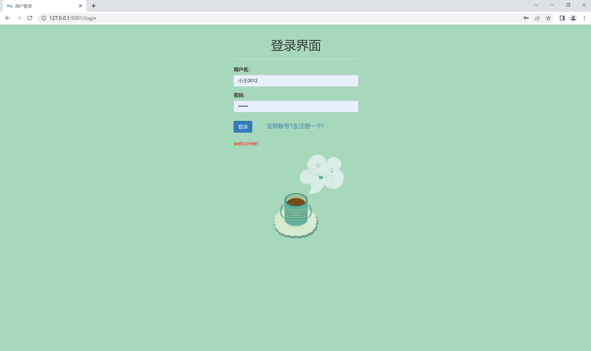

###   (2) 注册用户界面

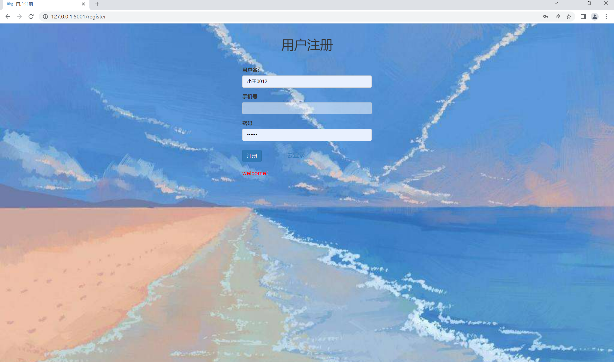

### （3）修改密码页面

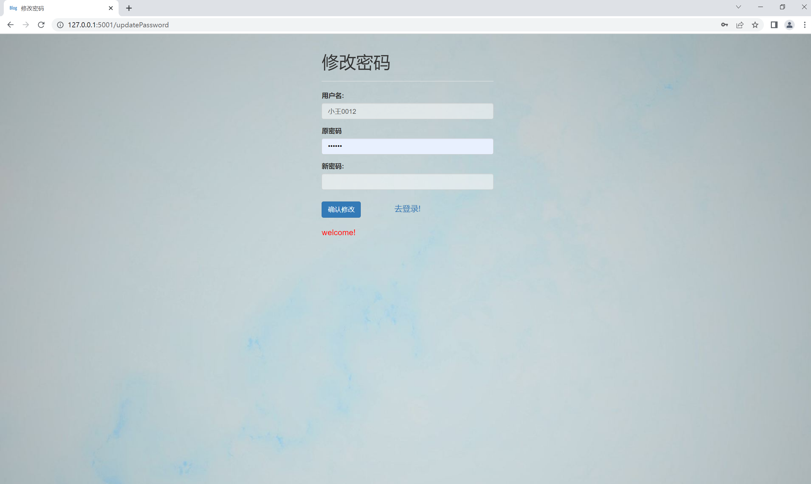

### （4） Blog主页

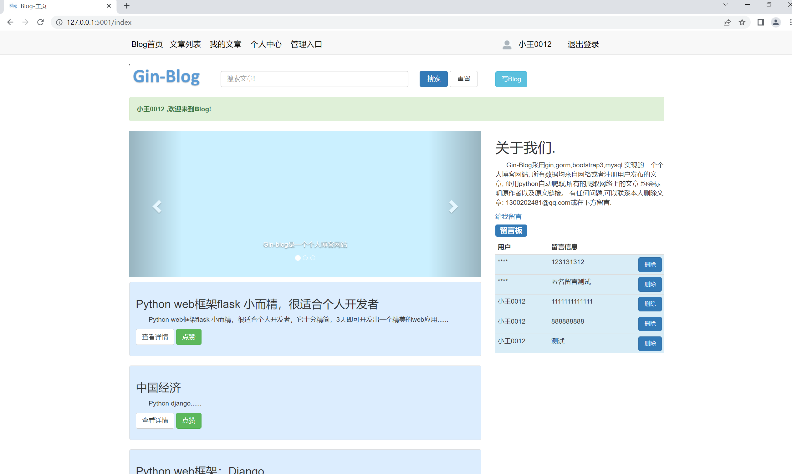

### （5） 文章列表页面

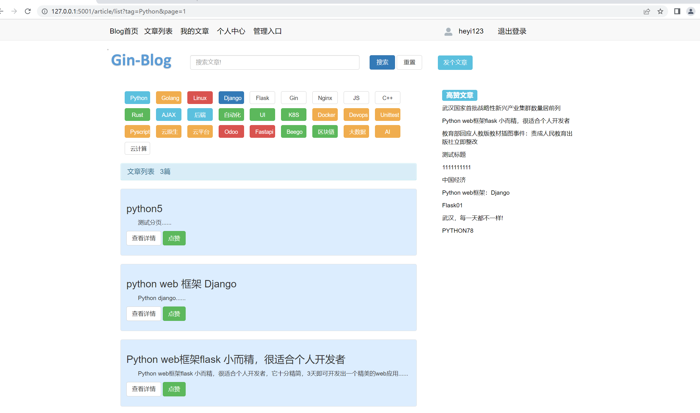

###    (6) 编辑文章页面

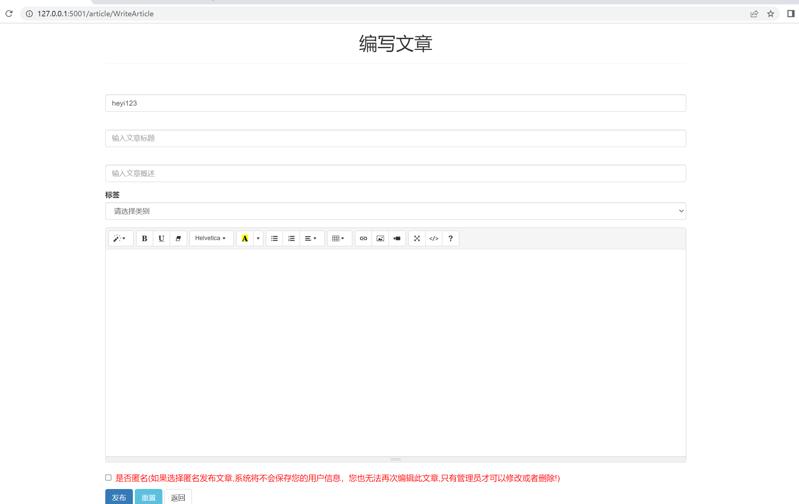

### （7） 文章详情页面

### （8）我的文章页面

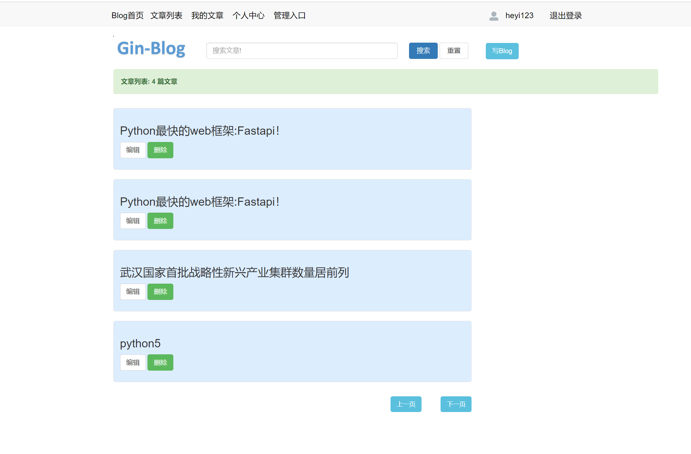

### （9）我的文章编辑界面

### （10）个人信息页面

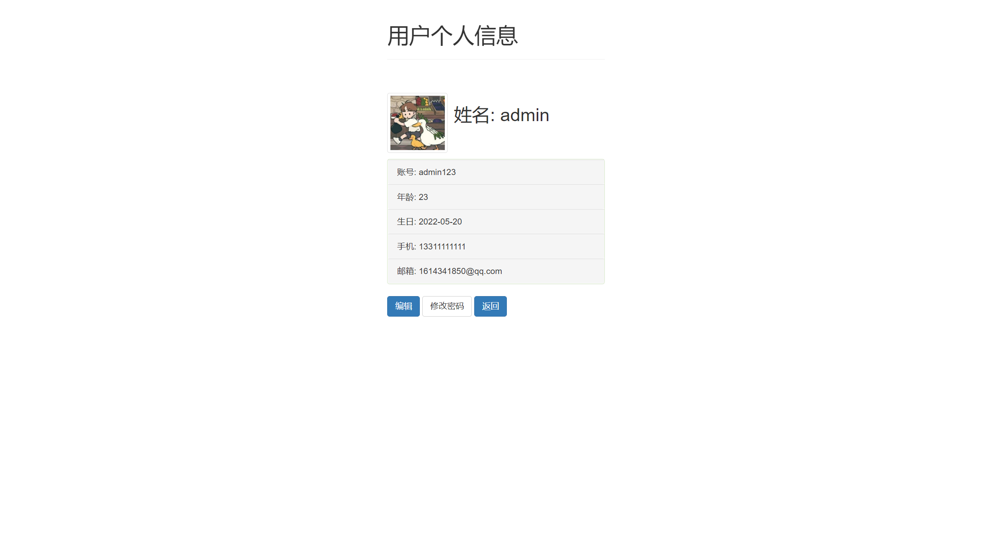

### (11) 编辑个人信息界面

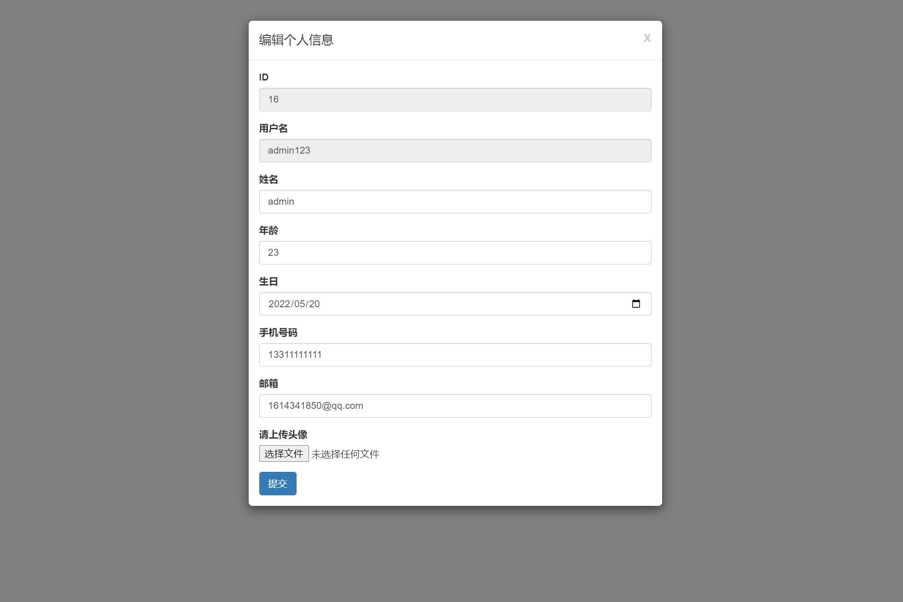

### (12) 后台管理-用户管理界面

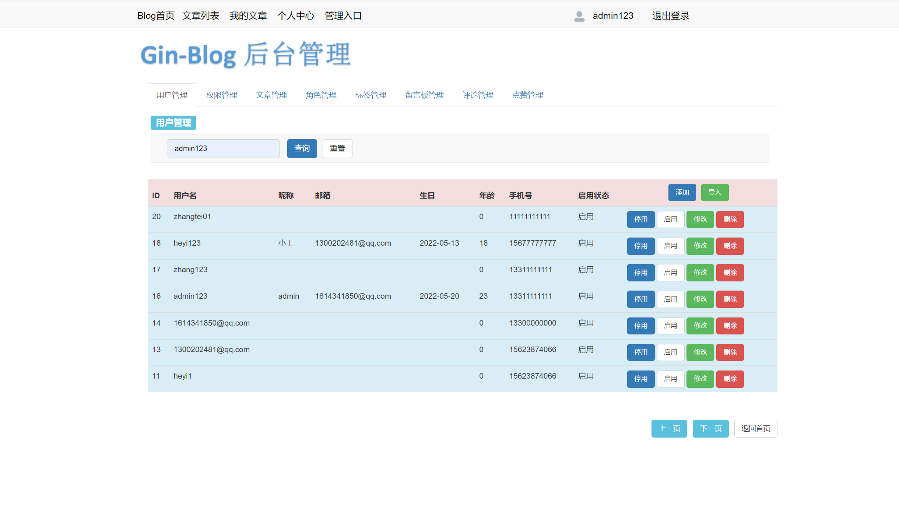

### (13) 后台管理-权限管理界面

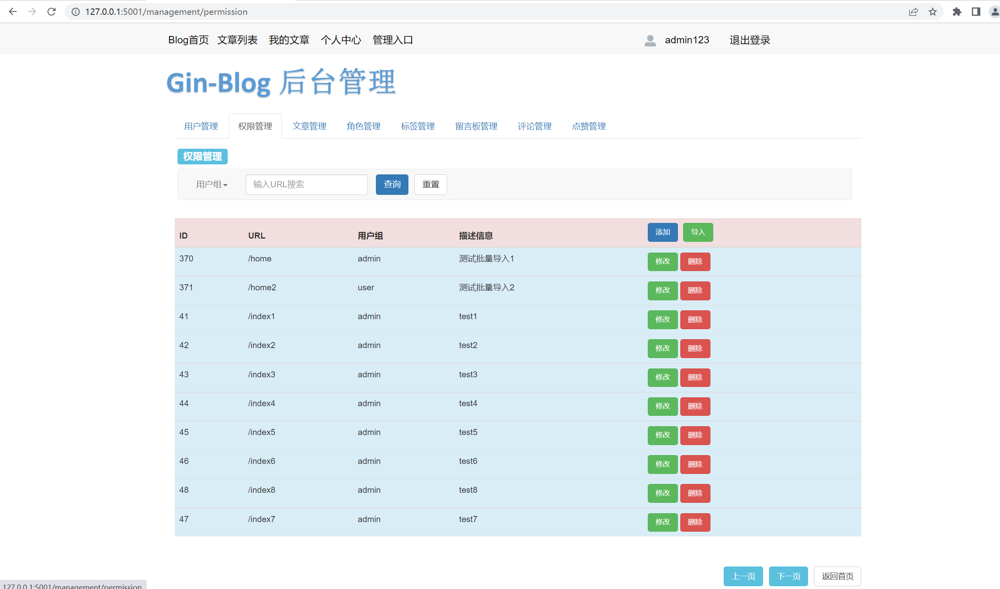

### (14) 后台管理-文章管理界面

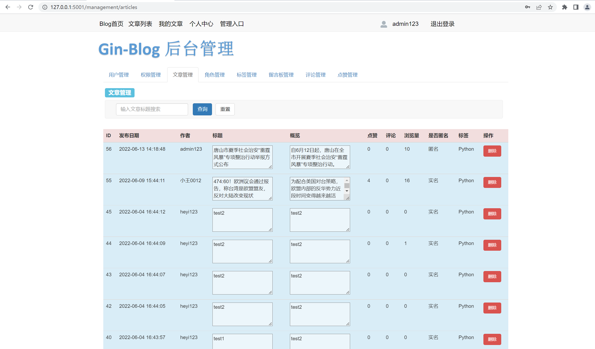

## 2.使用Nginx部署

### (1) 将代码打包成二进制 ,使用命令: go build mian.go
#### 输入 ./main  即可执行二进制文件，若要后台运行: nohup ./main &
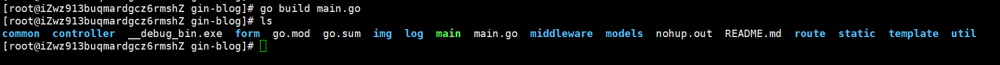

### (2) 安装Nginx ,使用命令：yum install nginx 
#### 重启nginx: nginx -s reload  启动：nginx  停止：nginx -s stop
#### nginx的配置，进入/etc/nginx/  使用vim编辑：vim nginx.conf 配置如下：
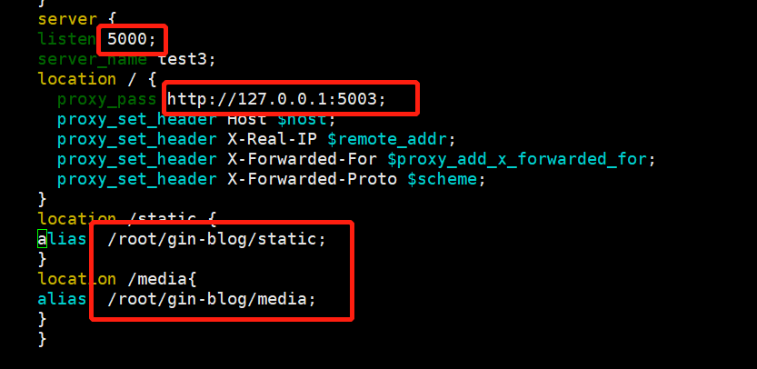

### (3) 安装Redis,使用命令：yum install redis
#### 启动redis:  找到安装路径直接运行即可：./bin/redis-server ,可以通过查看
#### 6379端口的占用情况判断redis是否运行成功：lsof -i:6379
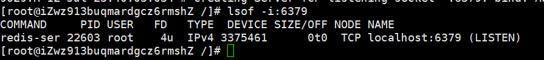

### (4) 安装Mysql,使用命令：yum install Mysql
#### 注意：不要使用简单的密码!  手动创建gin_blog_data 数据库：create database xxx;
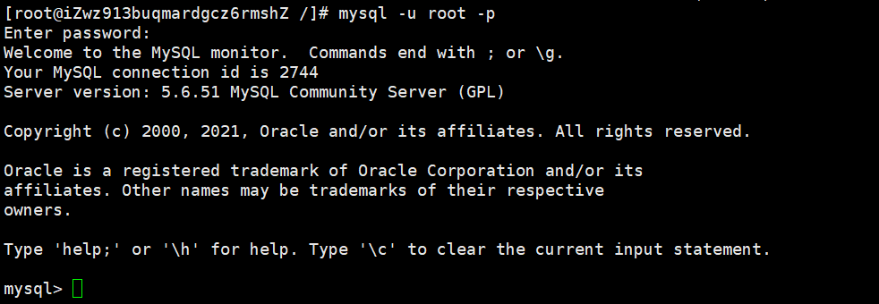

### (5) 后台运行程序
#### 使用 nohup ./main &即可运行
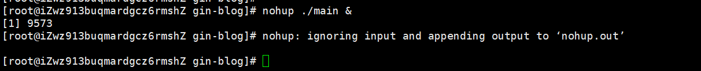
#### 查看main是否运行
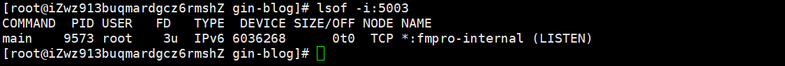

### (6) 测试网站是否部署成功
#### 访问网页查看图片是否显示正常，能否正常登录等等
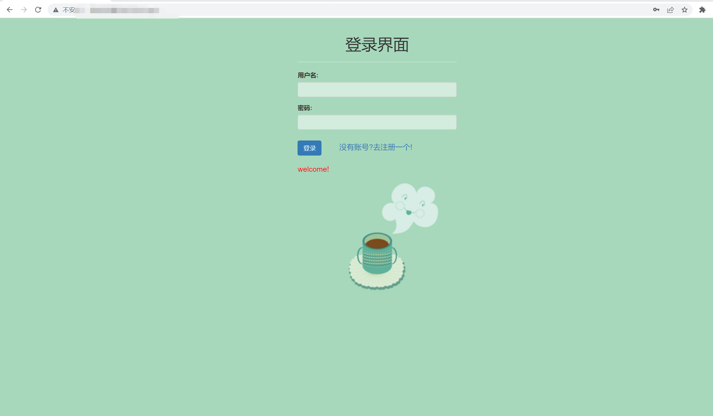
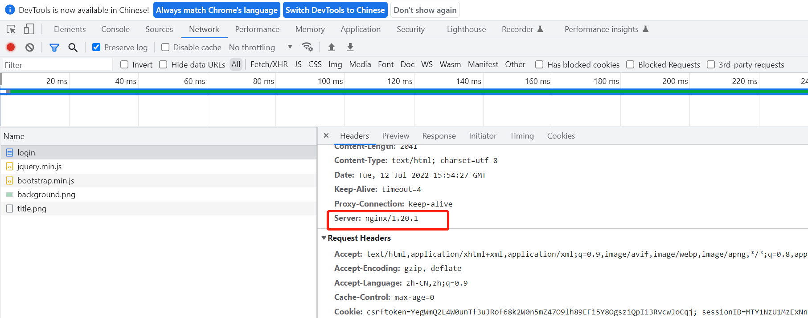

# 感谢

