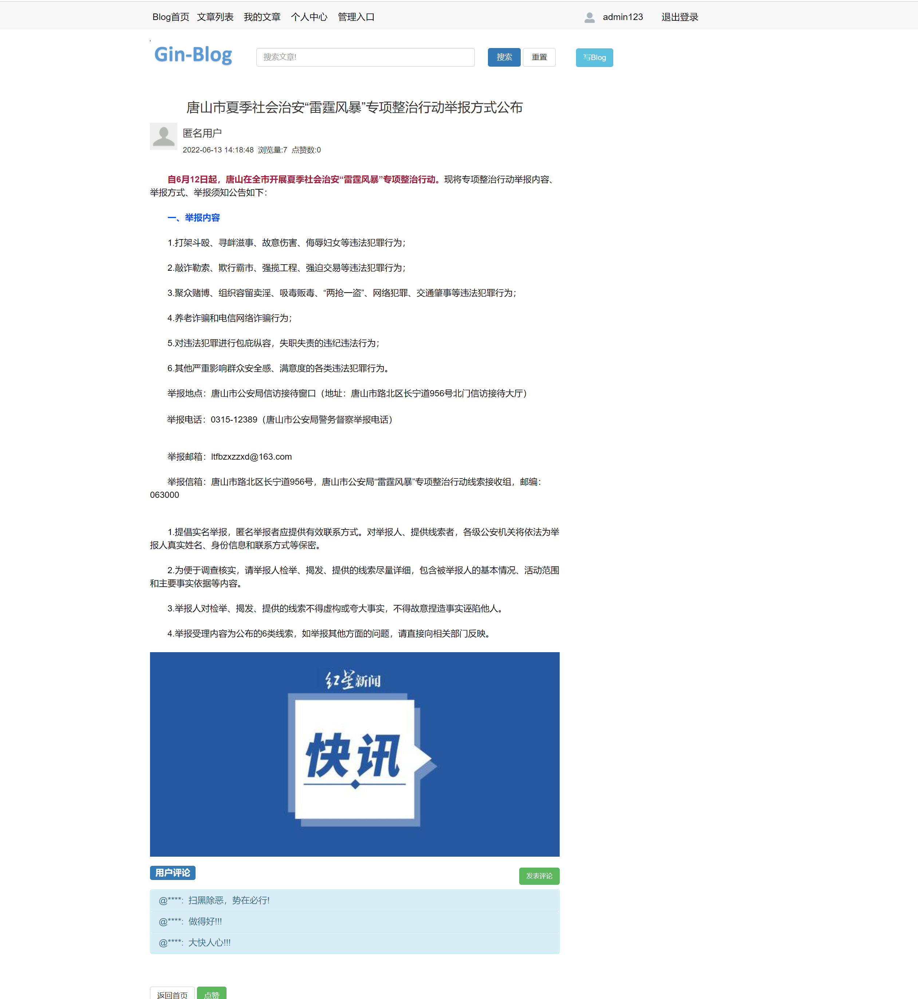
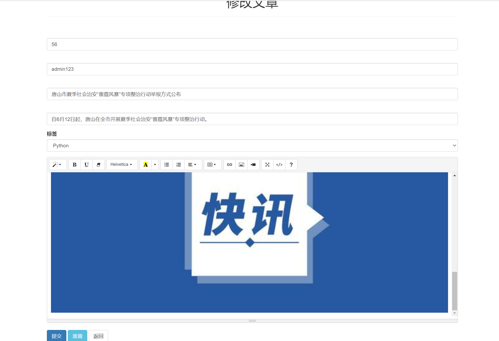

# 使用 Gin + Gorm + mysql + redis + bootstrap实现的个人博客web应用

## 1.界面截图

### （1）登录界面

###   (2) 注册用户界面

### （3）修改密码页面

### （4） Blog主页

### （5） 文章列表页面

###    (6) 编辑文章页面

### （7） 文章详情页面

### （8）我的文章页面

### （9）我的文章编辑界面

### （10）个人信息页面

### (11) 编辑个人信息界面

### (12) 后台管理-用户管理界面

### (13) 后台管理-权限管理界面

### (14) 后台管理-文章管理界面

### (15) 后台管理-角色管理界面

### (16) 后台管理-标签管理界面

### (17) 后台管理-留言板管理界面

### (18) 后台管理-评论管理界面

### (19) 后台管理-点赞管理界面

## 感谢

